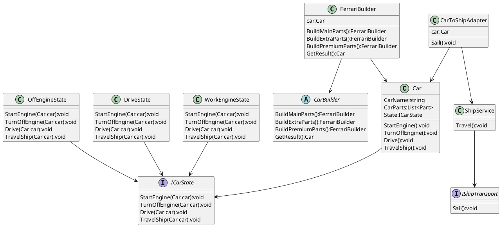

# Практическая работа №2
## выполнил Пахомов Алексей Дмитриевич группа БСБО-11-21

## Описание
Сценарий работы паттернов будет показан на примере конструирования автомобилей с различными характеристиками и функциями передвижения как своим ходом, так и на пароме.
В качестве паттернов были выбраны: Паттерн Адаптер, Паттерн Строитель и Паттерн Состояние

## Паттерн - Адаптер
Паттерн Адаптер (Adapter) предназначен для преобразования интерфейса одного класса в интерфейс другого. Благодаря реализации данного паттерна мы можем использовать вместе классы с несовместимыми интерфейсами. 

## Паттерн - Строитель
Строитель (Builder) - шаблон проектирования, который инкапсулирует создание объекта и позволяет разделить его на различные этапы.

В нашем приложении участниками являются:
* Car: представляет объект автомобиля, который должен быть создан. В данном случае все части объекта заключены в списке CarParts.

* CarBuilder: определяет интерфейс для создания различных частей объекта Car

* FerrariBuilder: конкретная реализация CarBuildera. Создает объект Car и определяет интерфейс для доступа к нему

## Паттерн - Состояние
Состояние (State) - шаблон проектирования, который позволяет объекту изменять свое поведение в зависимости от внутреннего состояния. 

## Диаграмма классов UML

